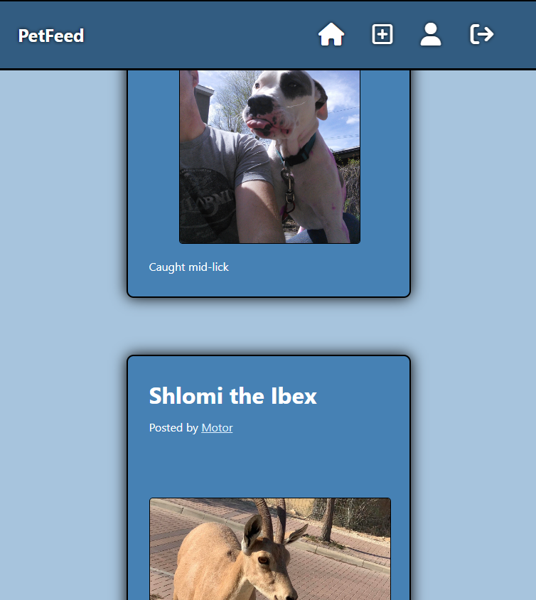

# petFeed

## Description
Everybody loves their pets, and so do we!  So we wanted them to have a social media platform where humans are not at the top of the feed.

## Table of Contents 
- [Installation](#installation)
- [Usage](#usage)
- [Credits](#credits)
- [MIT license License](#license)

    

## Screenshot

## Installation
This application is entirely online.  Just follow the [link](https://petfeed.herokuapp.com/) to our favorite pets.

## Usage
Go to the [website](https://petfeed.herokuapp.com/) and create a user, then browse the pets, comment, and upload your own.

## Questions

If you have any questions about this application send us a message on [github](https://github.com/).

[github](https://github.com/) repo's for: 
 - [Jace Edwards](https://github.com/Jacee94)
 - [Brent Keller](https://github.com/bikeller104)
 - [Leland Johnson](https://github.com/eljayman)
 - [Rhonda Van Dam](https://github.com/Rhondoid)

## How to Contribute
This was developed by [Jace](https://github.com/Jacee94), [Brent](https://github.com/bikeller104), [Leland](https://github.com/eljayman),and [Rhonda](https://github.com/Rhondoid).  Please visit their github profiles after you upload your favorite pets on [petfeed](https://petfeed.herokuapp.com/).

## Tests
If you find any errors with this application, please let us know by sending us a message on github.

## Credits

This application was made to run in [node.js](https://nodejs.org/) and uses [express.js](https://expressjs.com/) as a server with [express-handlebars](https://www.npmjs.com/package/express-handlebars) for rendering and [express-session](https://www.npmjs.com/package/express-session) for handling the cookie (never eat raw cookies,) [bcrypt](https://www.npmjs.com/package/bcrypt) to encrypt passwords, [dotenv](https://www.npmjs.com/package/dotenv) for environment variable storage, [Sequelize](https://sequelize.org/) for ORM, [tailwindcss](https://tailwindcss.com/) for styling, [Cloudinary](https://cloudinary.com/) for cloud storage, [multer](https://www.npmjs.com/package/multer) for handling form-data, [mysql](https://www.mysql.com/), [mysql2](https://www.npmjs.com/package/mysql2) and [jawsDB](https://www.jawsdb.com/) for database services.

## License

    Copyright 2022 eljayman

Permission is hereby granted, free of charge, to any person obtaining a copy of this software and associated documentation files (the "Software"), to deal in the Software without restriction, including without limitation the rights to use, copy, modify, merge, publish, distribute, sublicense, and/or sell copies of the Software, and to permit persons to whom the Software is furnished to do so, subject to the following conditions:

The above copyright notice and this permission notice shall be included in all copies or substantial portions of the Software.

THE SOFTWARE IS PROVIDED "AS IS", WITHOUT WARRANTY OF ANY KIND, EXPRESS OR IMPLIED, INCLUDING BUT NOT LIMITED TO THE WARRANTIES OF MERCHANTABILITY, FITNESS FOR A PARTICULAR PURPOSE AND NONINFRINGEMENT. IN NO EVENT SHALL THE AUTHORS OR COPYRIGHT HOLDERS BE LIABLE FOR ANY CLAIM, DAMAGES OR OTHER LIABILITY, WHETHER IN AN ACTION OF CONTRACT, TORT OR OTHERWISE, ARISING FROM, OUT OF OR IN CONNECTION WITH THE SOFTWARE OR THE USE OR OTHER DEALINGS IN THE SOFTWARE.
    

  